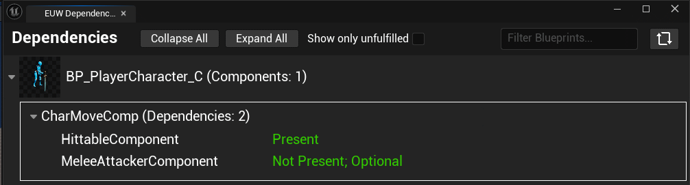
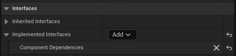
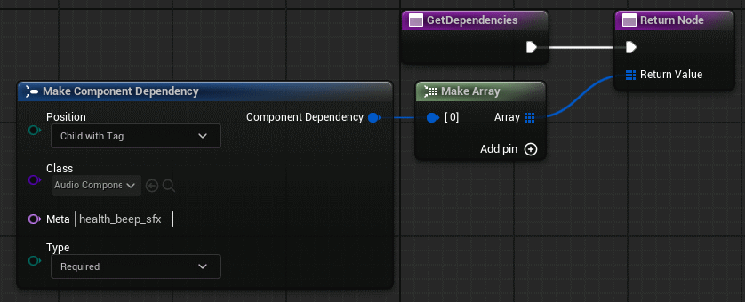

## Component Dependencies Plugin (CompDep)
Working with `ActorComponent`s and `SceneComponent`s in Unreal Engine is part of the standard workflow. Unreal, however, lacks any real tools to manage inter-component dependencies. This plugin seeks to remedy that and provide a solid solution to confirm dependencies at editor-time, easily.

## How to Install

To install this plugin project-local:

1. Clone or download this repository
2. In your game project folder, create a `Plugins` folder if you don't already have one:
```
MyGameProject/
--> Plugins/
```

3. Copy the `Source/CompDep` folder into your plugins folder:
```
MyGameProject/
--> Plugins/
----> CompDep/
------> CompDep.uplugin
------> ...
```

4. Launch or restart the editor
5. In the plugins window, find `CompDep` and make sure it's enabled
6. Click `Restart Now` if prompted

## How to Use

A component may depend on other components using this library. There are 4 dependency types:
- `AnyOnActor`: The actor this component is on needs the given dependency component type somewhere on it
- `AnyOnActorWithTag`: Same as `AnyOnActor`, but the dependency component also needs the given component tag
- `Child`: Only for SceneComponents. The blueprint must have a component with the given depedency component type as a child of this SceneComponent
- `ChildWithTag`: Same as `Child`, but the given dependency component that is a child also needs the given component tag

Components may also be either `Required` or `Optional` on top of these choices.

Once you define your component dependencies, they will show up in the editor when selecting the component:


Or, in bulk, in the Dependency Viewer under `CompDep > Open Dependency Viewer` in the top bar:



## How to Implement: Blueprints
1. Create a blueprint component asset:


2. Implement the `Component Dependencies` interface in this blueprint's class:



3. Implement the `Get Dependencies` interface method, and define your dependencies in the given array:



Now when you recompile the blueprint, the dependencies will be active.

## How to Implement: C++

1. Make sure your module lists the `CompDep` module as dependency, either private or public:
```cpp
public MyModule(ReadOnlyTargetRules Target) : base(Target)
{
	PCHUsage = PCHUsageMode.UseExplicitOrSharedPCHs;

	PublicDependencyModuleNames.AddRange([
		"Core",
		"CompDep"
	]);
}
```

2. In your component class header, form your class declaration like this:
```cpp
class MYMODULE_API UHealthComponent : public USceneComponent, public IComponentDependencies
{
	GENERATED_BODY()
	COMPDEP_DECL()
...
```

3. In your implementation file, preferably directly below your includes, define the dependencies like this:
```py
COMPDEP_IMPL_START(UHealthComponent)
	COMPDEP_DEP_ChildWithTagRequired(UAudioComponent, "health_beep_sfx")
COMPDEP_IMPL_END
```

The options for dependencies are:
```cpp
COMPDEP_DEP_AnyOnActorRequired(DependencyClass)
COMPDEP_DEP_AnyOnActorOptional(DependencyClass)
COMPDEP_DEP_AnyOnActorWithTagRequired(DependencyClass, Tag)
COMPDEP_DEP_AnyOnActorWithTagOptional(DependencyClass, Tag)
COMPDEP_DEP_ChildRequired(DependencyClass)
COMPDEP_DEP_ChildOptional(DependencyClass)
COMPDEP_DEP_ChildWithTagRequired(DependencyClass, Tag)
COMPDEP_DEP_ChildWithTagOptional(DependencyClass, Tag)
```
